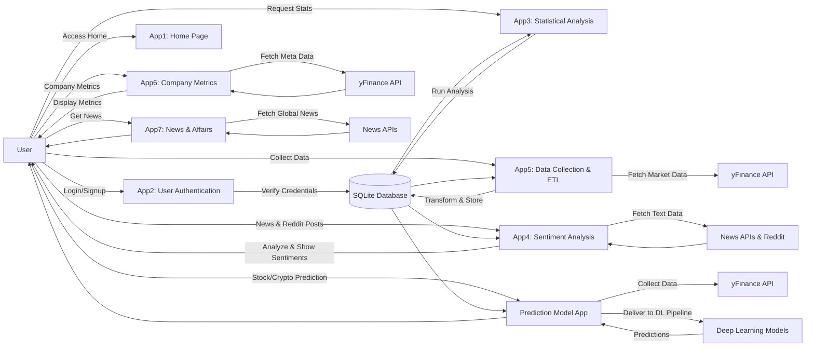
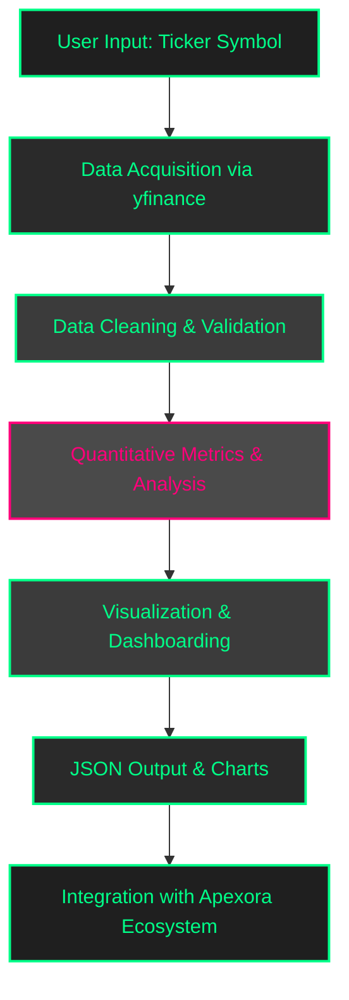
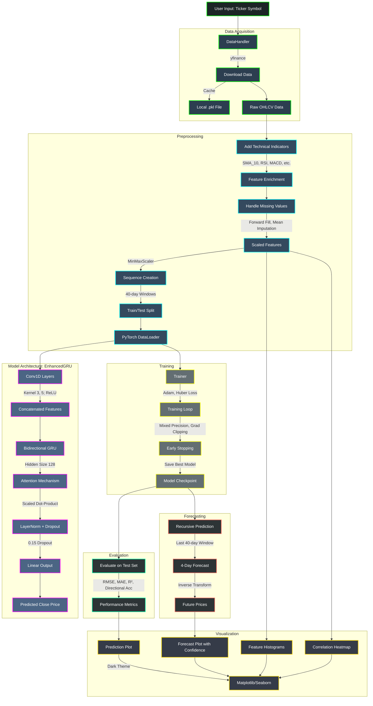

#  APEXORA.      (not deployed comming soon)

## Introduction

Apexora is an **AI-driven, multi-model prediction and advanced statistical analysis platform** designed for comprehensive stock market insights. It integrates financial data, sentiment analysis, and machine learning to empower investors, traders, and developers. By combining real-time stock metrics, news sentiment, social media insights, and predictive modeling, Apexora provides a deep and actionable understanding of market trends. Its modular Flask-based architecture ensures flexibility and scalability, allowing seamless customization for both personal and enterprise applications.

<table>
  <tr>
    <td></td>
    <td></td>
  </tr>
  <tr>
    <td></td>
    <td></td>
  </tr>
</table>


# How Apexora Works

Apexora is a modular **Flask application** built with Blueprints that handle distinct functionalities, enabling a scalable and maintainable architecture. Its workflow integrates data collection, processing, analysis, and prediction into a cohesive system that delivers actionable stock market insights.  

The system begins with **data collection**, fetching real-time stock prices and volumes via **yfinance**, company financials through **FinancialModelingPrep**, and news or social media insights via **News API** and Reddit client integration. This ensures Apexora has a rich dataset that combines market data with sentiment-driven information.  

Once collected, the **data processing** pipeline (`app5`) performs ETL operations to clean, normalize, and store the information in an **SQLite database**. This enables efficient querying and provides a solid foundation for downstream analysis and predictive modeling.  

User interaction and security are handled through **App2**, which manages **user authentication** (sign-up, login, and secure access) and provides input forms for stock tickers. App2 leverages **yfinance** for live market data and integrates sentiment insights from **News API** and Reddit. Using **NLTK**, textual data from news and social sources are preprocessed and converted into meaningful **positive/negative sentiment scores**, offering users personalized and actionable insights.  

**App3** focuses on **statistical analysis and visualization**. It delivers interactive dashboards powered by **Plotly**, allowing users to explore technical indicators such as RSI, moving averages, and MACD. Sentiment analysis results, computed with **VADER** and Transformer models, are visualized alongside market trends. Users can access a **multi-model prediction dashboard** to forecast any stock or cryptocurrency of their choice. The models are trained in real-time, ensuring that predictions reflect the most recent market data.  

**App4** is dedicated to **prediction**, where a **PyTorch-based LSTM model** forecasts next-day stock prices using normalized historical datasets. Complementary Transformer-based NLP models enhance predictions by incorporating sentiment-driven signals from news and social media, providing a more comprehensive view of market behavior.  

Finally, **App5** automates **ETL and storage**, handling feature engineering, database updates, and pipeline orchestration. This ensures that the system scales efficiently as new data arrives, maintaining accuracy and speed across the entire forecasting workflow.  

Overall, Apexora seamlessly integrates data ingestion, preprocessing, modeling, and visualization into a single, modular web application, empowering users with real-time market intelligence and predictive insights.


# Advanced Technology Stack  

Apexora’s technology stack is carefully designed for **performance, scalability, and real-time financial analysis**. The platform is built using **Flask**, a lightweight Python framework, which enables modular web development and easy integration of multiple components. For financial data, Apexora leverages **yfinance** to retrieve both real-time and historical stock metrics, complemented by **financialmodelingprep** APIs, various news APIs, and **Reddit’s PRAW** client for sentiment-driven insights.  

Interactive visualizations are created using **Plotly**, allowing users to explore metrics, technical indicators, and sentiment trends seamlessly. The predictive engine is powered by **PyTorch**, utilizing **LSTM models** for accurate stock price predictions. Additionally, **Transformers from Hugging Face** are employed for advanced natural language processing, while **NLTK** and **VADER** handle lightweight sentiment analysis of news and social media text.  

Data is efficiently stored and queried using **SQLite**, with supporting Python libraries such as **pandas**, **NumPy**, **scikit-learn**, **matplotlib**, **seaborn**, and **SHAP** assisting in data processing, analysis, and explainability. This carefully integrated stack ensures that Apexora combines web development, data science, and AI into a **robust, high-performance platform for comprehensive market analysis**.
This modular design ensures **scalability, real-time analytics, and smooth integration with trading platforms** or external APIs.  

### Project Structure

Apexora’s modular structure uses **Flask Blueprints** for organized functionality. Below is the updated structure, including apps 1–7, Docker setup, and the outer multi-model prediction app folder:
```
multi_model_prediction/
├── flask_app/
│ ├── app1/ # Home page
│ │ ├── init.py
│ │ ├── routes.py
│ │ └── templates/
│ │ └── home.html
│ ├── app2/ # User authentication
│ │ ├── init.py
│ │ ├── routes.py
│ │ ├── models.py
│ │ └── templates/
│ │ ├── login.html
│ │ └── signup.html
│ ├── app3/ # Statistical analysis
│ │ ├── init.py
│ │ ├── routes.py
│ │ └── templates/
│ │ └── index.html
│ ├── app4/ # Sentiment analysis
│ │ ├── init.py
│ │ ├── routes.py
│ │ └── templates/
│ │ └── index.html
│ ├── app5/ # Data collection & ETL
│ │ ├── init.py
│ │ ├── routes.py
│ │ ├── etl.py
│ │ └── templates/
│ │ └── index.html
│ ├── app6/ # Company metrics fetching
│ │ ├── init.py
│ │ ├── routes.py
│ │ └── templates/
│ │ └── index.html
│ ├── app7/ # News and affairs
│ │ ├── init.py
│ │ ├── routes.py
│ │ └── templates/
│ │ └── index.html
│ ├── run.py
│ └── README.md
├── docker/ # Docker configuration
│ └── Dockerfile
└── atock & crypto prediction model/ # for multi-model predictions
├── app.py
├── templates/
├── static/
└── README.md

✨ Notes:  
- Each `app` handles a specific functionality, ensuring modularity and easy maintenance.  
- `docker/` contains your Dockerfile for containerization.  
- `multi_model_app/` is the outer folder for prediction apps, with its own `app.py`, templates, and static assets.  

If you want, I can also **draw a visual diagram of the folder structure** for your README so it looks professional and easy to understand.  

Do you want me to do that?

```
---
# Sentiment Analysis 

The sentiment analysis module in Apexora, encapsulated within **app4**, is a critical component for understanding market perceptions of specific stocks. This module leverages **natural language processing (NLP)** to analyze textual data from multiple sources, providing insights into public and media sentiment. By processing news headlines and social media posts, app4 generates sentiment scores that help users gauge market mood, which can influence trading decisions. The module is designed to be both robust and flexible, combining lightweight and advanced NLP techniques to ensure accurate and contextually relevant results.

Data is sourced primarily from **Reddit** via the **PRAW library** and news APIs such as **NewsAPI** and **FinancialModelingPrep**. Reddit provides real-time social sentiment from user discussions, while news APIs deliver structured headline data. The pipeline begins with data collection, where text is filtered by ticker or keyword to ensure relevance. Preprocessing steps include tokenization, removing stop words, and cleaning text to eliminate noise such as special characters or irrelevant terms. This cleaned data is then analyzed using two complementary approaches: **VADER** for lexicon-based scoring and a **transformer-based model** (e.g., BERT from Hugging Face) for contextual sentiment analysis.

**VADER** (Valence Aware Dictionary and sEntiment Reasoner) is a rule-based model optimized for social media text, producing sentiment scores ranging from **-1 (highly negative) to +1 (highly positive)**. It is computationally efficient, making it ideal for rapid analysis of large datasets. The transformer model, on the other hand, captures nuanced emotions by considering the context of entire sentences, which is particularly useful for complex news articles. Scores from both methods are aggregated into a **composite sentiment score**, weighted by factors such as source reliability and recency of the data. This composite score provides a balanced view of market sentiment.

Results are visualized as static plots, such as bar charts or time-series graphs, and saved to the app4 **static folder**. These visualizations, generated using libraries like **matplotlib** or **seaborn**, allow users to quickly interpret sentiment trends. The module outputs sentiment scores, key headlines or posts, and plot URLs, which are accessible via the `/sentiment/` API endpoint. For performance optimization, transformer models are cached locally, and heavy computations can be offloaded to background workers using tools like **Celery**. Sensitive API keys are stored in **environment variables** to ensure security and maintain best practices.

---
## Complete Flow Chart of Apexora



# Statistical Analysis & Multi-Metric Dashboard

**App3** is a high-performance **financial analytics module** within the Apexora ecosystem. It delivers **comprehensive stock and cryptocurrency analysis** by integrating historical and real-time market data, advanced quantitative metrics, and interactive visualizations. Users gain actionable insights and a **multi-dimensional view of market behavior**.  

Access to App3 is carefully controlled to ensure **security and privacy**. Only **authenticated users** from `app2` can access the platform through **session-based authentication**, and the **_login_required_** decorator ensures that unauthorized access redirects users to the login page. This setup safeguards sensitive financial information and maintains a secure environment for all analytics operations.  

Users interact with App3 by providing a **ticker symbol** representing a stock, ETF, or cryptocurrency. The platform fetches **market data** using **_yfinance_**, including historical OHLCV data for the past year and benchmark indices such as the S&P 500 for comparative analysis. Users can adjust **date ranges** and **data frequency**—daily, weekly, or monthly—allowing for flexible and dynamic evaluation of market trends.  

The **analytical engine** of App3 computes a wide spectrum of **financial, statistical, and risk metrics** using **_pandas_** and **_NumPy_**. It calculates **price and return metrics**, including daily returns, logarithmic returns, cumulative returns, and **CAGR**. The platform evaluates **trend and momentum indicators**, such as SMA, EMA, MACD, RSI, Stochastic Oscillator, and ADX, while also calculating **volatility and risk measures** including standard deviation, ATR, annualized volatility, Beta relative to benchmarks, Sharpe Ratio, maximum drawdown, and correlation coefficients. In addition, App3 identifies **support and technical levels** like pivot points, Fibonacci retracements, and VWAP, providing actionable insights for investment decisions.  

To ensure reliable results, App3 performs **data cleaning and validation**, replacing missing or `NaN` values with **_None_** for proper **JSON serialization**. This guarantees accurate and consistent visualization across the platform.  

The platform offers **interactive visualizations** for comprehensive market analysis. Price and trend charts feature **candlestick patterns** with SMA, EMA, and Bollinger Bands overlays. Volume trends are displayed using line and bar charts, while momentum indicators such as RSI, MACD, and Stochastic Oscillator provide clear signals. App3 also summarizes trends and performance metrics, helping users make informed decisions at a glance.  

Error handling and user feedback are carefully integrated. Invalid tickers or missing data trigger **informative UI messages**, while unexpected exceptions are logged and reported gracefully to maintain a smooth user experience.  

App3 produces **JSON-formatted chart data** and a comprehensive **metrics dictionary** covering price, volatility, trend, risk, and technical levels. These outputs are seamlessly integrated with the Apexora ecosystem, supporting **multi-model predictions**, **real-time updates**, and correlations with sentiment analysis from `app4`. This enables users to gain a **holistic view of market behavior** across multiple assets.  

Key libraries powering App3 include **_yfinance_** for market data, **_pandas_** and **_NumPy_** for high-performance calculations, **Flask** and **Jinja2** for web framework and templating, **JSON** for structured data exchange, and **datetime** utilities for trend and CAGR analysis.  

In summary, App3 empowers users to **analyze any stock or cryptocurrency**, evaluate historical performance, monitor risk, and identify trends using advanced multi-metric analytics—all within a responsive and interactive web dashboard.


### Workflow Diagram




---


# Apexora: Stock Price Forecasting Web Application

# Enhanced Stock Predictor: Overview

The enhanced stock predictor is a sophisticated deep learning system designed for forecasting stock prices. It leverages a hybrid model combining Conv1D layers, bidirectional Gated Recurrent Units (BiGRU), and a scaled dot-product attention mechanism. This document provides a comprehensive, paragraph-based explanation of the workflow, emphasizing feature engineering, technical indicators, data processing, and the EnhancedGRU model’s architecture and functionality. The goal is to give a clear understanding of the system’s components, their roles, and how they contribute to robust stock price predictions, without relying on mathematical equations.

---

## Workflow Overview

The workflow starts with the user entering a stock ticker symbol, such as AAPL or TSLA, with AAPL as the default if no input is provided. Historical stock data is retrieved from Yahoo Finance using the `yfinance` library, spanning from January 1, 2022, to the current date, August 27, 2025. To optimize performance, the data is cached locally in a pickle file, allowing quick access for subsequent runs without re-downloading. 

The raw data undergoes extensive preprocessing, including the addition of various technical indicators to capture market patterns, handling missing or invalid values, and normalizing the data to a consistent scale. The processed data is then organized into 40-day sequences, split into 80% for training and 20% for testing, and loaded into PyTorch DataLoaders for efficient batch processing. 

The EnhancedGRU model is trained using the Adam optimizer, Huber loss for robust error handling, mixed precision for faster GPU computation, gradient clipping to stabilize training, and early stopping to prevent overfitting. After training, the model evaluates performance on the test set using metrics such as root mean squared error (RMSE), mean absolute error (MAE), R-squared (R²), and directional accuracy. It also generates recursive forecasts for the next four days by default, feeding predicted values back into the model. Results are visualized through plots showing historical prices, predictions, and forecast confidence intervals, along with feature distribution histograms and correlation heatmaps for deeper insights.

---

## Feature Engineering and Technical Indicators

Feature engineering is a cornerstone of the system, transforming raw stock data into a rich, multivariate time-series input that captures diverse market dynamics. The script combines raw price data with a carefully selected set of technical indicators to enhance the model’s ability to detect trends, momentum, volatility, and market sentiment. Below is a paragraph-based explanation of the features and technical indicators, focusing on their purpose and computation process.

### Base Features

- **Close:** The closing price is the stock’s final trading price at the end of each day and serves as the primary target for prediction. It reflects the market’s valuation of the stock at a given point, making it central for forecasting future prices.  
- **High:** The highest price reached during the trading day captures the peak of intraday activity. This feature helps the model understand the upper bounds of price movements, providing insight into intraday volatility and market enthusiasm.  
- **Low:** The lowest price during the trading day complements the high price, indicating the trough of intraday fluctuations. Together with the high price, it provides a complete picture of the day’s price range, aiding in volatility analysis.

These base features are directly obtained from Yahoo Finance data and form the foundation for modeling price dynamics, as they represent raw market behavior.


# Technical Indicators

To enrich the dataset, the script computes 15 technical indicators. Each indicator is designed to capture specific aspects of market behavior, such as trends, momentum, volatility, or potential reversals. These indicators are derived from the raw price data and added to provide the model with broader context for prediction.

### Key Technical Indicators

- **SMA_10 (10-Day Simple Moving Average):** Calculates the average closing price over the past 10 trading days. It smooths short-term fluctuations, helping the model identify the overall trend direction—upward, downward, or sideways.

- **RSI (Relative Strength Index, 14-Day):** Measures the speed and change of price movements over a 14-day period to assess if a stock is overbought or oversold. High values (above 70) indicate overbought conditions; low values (below 30) suggest oversold conditions, assisting the model in detecting potential reversals.

- **MACD (Moving Average Convergence Divergence):** Computed by subtracting the 26-day EMA from the 12-day EMA of the closing price. Highlights the relationship between short-term and long-term trends, helping detect momentum shifts and potential trend reversals.

- **BB_Upper and BB_Lower (Bollinger Bands, 20-Day):** Composed of a 20-day SMA with upper and lower bands set two standard deviations from the mean. These bands measure volatility and help the model identify unusually high or low prices relative to recent history.

- **ATR (Average True Range, 14-Day):** Measures market volatility by averaging the largest of three values over 14 days: the daily high-low range, high-to-previous-close, and low-to-previous-close. Helps the model understand typical price movements and assess risk.

- **Price_Change (Daily Percentage Change):** Calculates the percentage change in closing price from one day to the next. Captures daily momentum and directional trends.

- **Log_Close (Logarithmic Close Price):** Applies a logarithmic transformation to stabilize variance and handle large price swings, improving the model’s ability to learn non-linear patterns.

- **Volatility_10, Volatility_20, Volatility_50 (Rolling Standard Deviation):** Measure the standard deviation of daily percentage changes over 10, 20, and 50 days, capturing short-, medium-, and long-term volatility.

- **Momentum_5 and Momentum_10:** Compute the difference between current closing price and closing price 5 or 10 days ago. Measures directional momentum to detect sustained upward or downward trends.

- **EMA_10 and EMA_20 (Exponential Moving Average):** Weighted averages of closing prices over 10 and 20 days, giving more weight to recent prices. React faster to recent changes than SMA, identifying short- and medium-term trends.

These technical indicators collectively provide a comprehensive view of stock behavior, capturing patterns that raw prices alone might miss. The script ensures robustness by verifying feature availability and falling back to the closing price if any indicator cannot be computed.

---

# Data Processing

Data processing transforms raw stock data into a format suitable for model training, ensuring reliability and consistency. The process involves several steps:

### 1. Data Download

- Uses the `yfinance` library to fetch daily stock data, including open, high, low, close, and volume (OHLCV) prices.
- Caches the data in a pickle file (e.g., `data_AAPL.pkl`) to avoid redundant downloads.
- Includes error handling to ensure the data contains critical columns (e.g., Close) and sufficient samples (at least 40 days).

### 2. Handling Missing and Invalid Values

- **Forward-filling:** Uses the most recent valid value to fill missing data, preserving the time-series nature.  
- **Mean imputation:** Replaces any remaining missing values with the column mean.  
- **Infinities/invalid numbers:** Replaced with the mean.  
- **Fallback:** Any persistent gaps are filled with zeros to ensure numerical stability.

### 3. Feature Scaling

- All features (raw prices and technical indicators) are normalized to a range of 0 to 1 using `MinMaxScaler`.
- This prevents bias toward larger-value features and ensures equal contribution to the model.
- The scaler is saved for later use to convert predictions back to original price units.

### 4. Sequence Creation

- Segments the data into 40-day sequences, each containing all features for 40 consecutive days.  
- The target for each sequence is the scaled closing price of the next day.  
- This creates a time-series input suitable for the model, capturing historical patterns leading to the prediction.

### 5. Train/Test Split

- Sequences are split into 80% for training and 20% for testing.  
- Temporal order is preserved to reflect real-world forecasting scenarios, ensuring the model trains on earlier data and tests on more recent data.

### 6. DataLoader Setup

- Converts sequences into PyTorch tensors using a custom `StockDataset` class.  
- Uses PyTorch `DataLoader` with batch size 64.  
- Shuffling is enabled for training to promote generalization, but disabled for testing to preserve temporal sequence.

---

This structured approach ensures that the model receives clean, normalized, and temporally consistent data, with engineered features that enhance predictive accuracy.
# Enhanced GRU Model: Detailed Explanation

The EnhancedGRU model is a hybrid neural network tailored for time-series forecasting. It combines convolutional layers, bidirectional GRU, and an attention mechanism to capture complex patterns in stock data. Below is a paragraph-based explanation of its components and functionality.

---

## Model Architecture

**Conv1D Layers:**  
The model begins with two parallel 1D convolutional layers, one with a kernel size of 3 and another with a kernel size of 5. These layers process input sequences consisting of 40 time steps and multiple features (e.g., Close, RSI, etc.). The convolutions extract local patterns such as short-term price trends or spikes by applying filters that slide over the time dimension. Padding ensures that the output sequence length remains 40. A ReLU activation function introduces non-linearity, and the outputs of both convolutional layers are concatenated, doubling the feature dimension to provide a richer representation of the input data.

**Bidirectional GRU:**  
The concatenated convolutional outputs feed into a bidirectional GRU with a hidden size of 128 and one layer. Unlike standard GRUs, which process sequences in one direction, the bidirectional GRU processes the sequence forward and backward, capturing both past and future contexts within the 40-day window. This is particularly useful for stock data, where future price movements may depend on historical trends and recent shifts. The GRU’s gating mechanisms regulate the flow of information, allowing the model to retain long-term dependencies while focusing on relevant patterns.

**Scaled Dot-Product Attention:**  
An attention mechanism follows the GRU, enabling the model to focus on the most relevant time steps within the 40-day sequence. It computes attention scores by comparing the GRU outputs to themselves, scales the scores to stabilize gradients, and applies a softmax function to produce weights. These weights determine how much each time step contributes to the final prediction, creating a context vector that summarizes the most important information. This adaptive focus improves the model’s ability to prioritize key market events.

**Output Processing:**  
The context vector from the attention mechanism undergoes layer normalization to stabilize values and reduce training variability. A dropout layer with a 15% rate is applied to prevent overfitting by randomly disabling some connections during training. Finally, a linear layer transforms the context vector into a single value, representing the predicted scaled closing price for the next day.

---

## Training Process

The model is trained using the Huber loss function, which combines the benefits of mean squared error (for small errors) and mean absolute error (for larger errors), making it robust to outliers in stock data. The Adam optimizer, with an initial learning rate of 0.0005, adjusts the model’s weights to minimize the loss. A learning rate scheduler reduces the learning rate by half if the validation loss does not improve for 10 epochs, helping the model converge effectively. Mixed precision training, enabled via `torch.cuda.amp`, speeds up computation and reduces memory usage on GPUs. Gradient clipping limits the magnitude of weight updates to prevent instability, and early stopping halts training if the validation loss plateaus for 15 epochs, saving the best model to a checkpoint file.

---

## Evaluation and Forecasting

**Evaluation Metrics:**  
The model evaluates performance on the test set using several metrics to assess prediction accuracy and trend reliability:  
- **Root Mean Squared Error (RMSE):** Measures the average magnitude of prediction errors, emphasizing larger deviations.  
- **Mean Absolute Error (MAE):** Calculates the average absolute difference between predicted and actual prices, providing a straightforward error measure.  
- **R-squared (R²):** Indicates how well the model explains variance in the actual data, with values closer to 1 showing better fit.  
- **Directional Accuracy:** Assesses the percentage of times the model correctly predicts the direction of price movement (up or down), which is crucial for trading decisions.

**Forecasting:**  
Predictions for the next four days are generated using a recursive strategy. The model starts with the last 40-day window of scaled features, predicts the next day’s closing price, and shifts the window to include the predicted value while dropping the oldest day. This process repeats for four days, producing a sequence of future prices. Predictions are converted back to the original price scale using the saved MinMaxScaler. Confidence intervals are added to the forecasts, calculated as the predicted price plus or minus the standard deviation of errors from the test set (or 10% of the forecast variance if test errors are unavailable), providing a range of likely outcomes.


# Diagram Workflow



# Conclusion
Apexora provides a deep and actionable understanding of market trends. Its modular Flask-based architecture ensures flexibility and scalability, allowing seamless customization for both personal and enterprise applications.

Unlike traditional stock analysis tools, Apexora leverages multiple predictive models simultaneously, enriched with technical indicators and sentiment-driven insights. This multi-dimensional approach enables more accurate forecasts, real-time updates, and interactive visualizations, making it a highly practical platform for decision-making. Whether for individual investors seeking an edge, traders optimizing strategies, or developers building financial applications, Apexora stands out as a versatile and insightful tool for navigating complex market dynamics.

