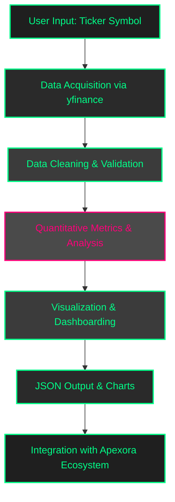
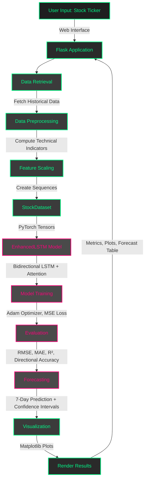

#  APEXORA

## Introduction

Apexora is an **AI-driven, multi-model prediction and advanced statistical analysis platform** designed for comprehensive stock market insights. It integrates financial data, sentiment analysis, and machine learning to empower investors, traders, and developers. By combining real-time stock metrics, news sentiment, social media insights, and predictive modeling, Apexora provides a deep and actionable understanding of market trends. Its modular Flask-based architecture ensures flexibility and scalability, allowing seamless customization for both personal and enterprise applications.

<table>
  <tr>
    <td></td>
    <td></td>
  </tr>
  <tr>
    <td></td>
    <td></td>
  </tr>
</table>


# How Apexora Works

Apexora is a modular **Flask application** built with Blueprints that handle distinct functionalities, enabling a scalable and maintainable architecture. Its workflow integrates data collection, processing, analysis, and prediction into a cohesive system that delivers actionable stock market insights.  

The system begins with **data collection**, fetching real-time stock prices and volumes via **yfinance**, company financials through **FinancialModelingPrep**, and news or social media insights via **News API** and Reddit client integration. This ensures Apexora has a rich dataset that combines market data with sentiment-driven information.  

Once collected, the **data processing** pipeline (`app5`) performs ETL operations to clean, normalize, and store the information in an **SQLite database**. This enables efficient querying and provides a solid foundation for downstream analysis and predictive modeling.  

User interaction and security are handled through **App2**, which manages **user authentication** (sign-up, login, and secure access) and provides input forms for stock tickers. App2 leverages **yfinance** for live market data and integrates sentiment insights from **News API** and Reddit. Using **NLTK**, textual data from news and social sources are preprocessed and converted into meaningful **positive/negative sentiment scores**, offering users personalized and actionable insights.  

**App3** focuses on **statistical analysis and visualization**. It delivers interactive dashboards powered by **Plotly**, allowing users to explore technical indicators such as RSI, moving averages, and MACD. Sentiment analysis results, computed with **VADER** and Transformer models, are visualized alongside market trends. Users can access a **multi-model prediction dashboard** to forecast any stock or cryptocurrency of their choice. The models are trained in real-time, ensuring that predictions reflect the most recent market data.  

**App4** is dedicated to **prediction**, where a **PyTorch-based LSTM model** forecasts next-day stock prices using normalized historical datasets. Complementary Transformer-based NLP models enhance predictions by incorporating sentiment-driven signals from news and social media, providing a more comprehensive view of market behavior.  

Finally, **App5** automates **ETL and storage**, handling feature engineering, database updates, and pipeline orchestration. This ensures that the system scales efficiently as new data arrives, maintaining accuracy and speed across the entire forecasting workflow.  

Overall, Apexora seamlessly integrates data ingestion, preprocessing, modeling, and visualization into a single, modular web application, empowering users with real-time market intelligence and predictive insights.


# Advanced Technology Stack  

Apexora’s technology stack is carefully designed for **performance, scalability, and real-time financial analysis**. The platform is built using **Flask**, a lightweight Python framework, which enables modular web development and easy integration of multiple components. For financial data, Apexora leverages **yfinance** to retrieve both real-time and historical stock metrics, complemented by **financialmodelingprep** APIs, various news APIs, and **Reddit’s PRAW** client for sentiment-driven insights.  

Interactive visualizations are created using **Plotly**, allowing users to explore metrics, technical indicators, and sentiment trends seamlessly. The predictive engine is powered by **PyTorch**, utilizing **LSTM models** for accurate stock price predictions. Additionally, **Transformers from Hugging Face** are employed for advanced natural language processing, while **NLTK** and **VADER** handle lightweight sentiment analysis of news and social media text.  

Data is efficiently stored and queried using **SQLite**, with supporting Python libraries such as **pandas**, **NumPy**, **scikit-learn**, **matplotlib**, **seaborn**, and **SHAP** assisting in data processing, analysis, and explainability. This carefully integrated stack ensures that Apexora combines web development, data science, and AI into a **robust, high-performance platform for comprehensive market analysis**.
This modular design ensures **scalability, real-time analytics, and smooth integration with trading platforms** or external APIs.  

### Project Structure

Apexora’s modular structure uses **Flask Blueprints** for organized functionality. Below is the updated structure, including apps 1–7, Docker setup, and the outer multi-model prediction app folder:
```
multi_model_prediction/
├── flask_app/
│ ├── app1/ # Home page
│ │ ├── init.py
│ │ ├── routes.py
│ │ └── templates/
│ │ └── home.html
│ ├── app2/ # User authentication
│ │ ├── init.py
│ │ ├── routes.py
│ │ ├── models.py
│ │ └── templates/
│ │ ├── login.html
│ │ └── signup.html
│ ├── app3/ # Statistical analysis
│ │ ├── init.py
│ │ ├── routes.py
│ │ └── templates/
│ │ └── index.html
│ ├── app4/ # Sentiment analysis
│ │ ├── init.py
│ │ ├── routes.py
│ │ └── templates/
│ │ └── index.html
│ ├── app5/ # Data collection & ETL
│ │ ├── init.py
│ │ ├── routes.py
│ │ ├── etl.py
│ │ └── templates/
│ │ └── index.html
│ ├── app6/ # Company metrics fetching
│ │ ├── init.py
│ │ ├── routes.py
│ │ └── templates/
│ │ └── index.html
│ ├── app7/ # News and affairs
│ │ ├── init.py
│ │ ├── routes.py
│ │ └── templates/
│ │ └── index.html
│ ├── run.py
│ └── README.md
├── docker/ # Docker configuration
│ └── Dockerfile
└── atock & crypto prediction model/ # for multi-model predictions
├── app.py
├── templates/
├── static/
└── README.md

✨ Notes:  
- Each `app` handles a specific functionality, ensuring modularity and easy maintenance.  
- `docker/` contains your Dockerfile for containerization.  
- `multi_model_app/` is the outer folder for prediction apps, with its own `app.py`, templates, and static assets.  

If you want, I can also **draw a visual diagram of the folder structure** for your README so it looks professional and easy to understand.  

Do you want me to do that?

```
---
# Sentiment Analysis 

The sentiment analysis module in Apexora, encapsulated within **app4**, is a critical component for understanding market perceptions of specific stocks. This module leverages **natural language processing (NLP)** to analyze textual data from multiple sources, providing insights into public and media sentiment. By processing news headlines and social media posts, app4 generates sentiment scores that help users gauge market mood, which can influence trading decisions. The module is designed to be both robust and flexible, combining lightweight and advanced NLP techniques to ensure accurate and contextually relevant results.

Data is sourced primarily from **Reddit** via the **PRAW library** and news APIs such as **NewsAPI** and **FinancialModelingPrep**. Reddit provides real-time social sentiment from user discussions, while news APIs deliver structured headline data. The pipeline begins with data collection, where text is filtered by ticker or keyword to ensure relevance. Preprocessing steps include tokenization, removing stop words, and cleaning text to eliminate noise such as special characters or irrelevant terms. This cleaned data is then analyzed using two complementary approaches: **VADER** for lexicon-based scoring and a **transformer-based model** (e.g., BERT from Hugging Face) for contextual sentiment analysis.

**VADER** (Valence Aware Dictionary and sEntiment Reasoner) is a rule-based model optimized for social media text, producing sentiment scores ranging from **-1 (highly negative) to +1 (highly positive)**. It is computationally efficient, making it ideal for rapid analysis of large datasets. The transformer model, on the other hand, captures nuanced emotions by considering the context of entire sentences, which is particularly useful for complex news articles. Scores from both methods are aggregated into a **composite sentiment score**, weighted by factors such as source reliability and recency of the data. This composite score provides a balanced view of market sentiment.

Results are visualized as static plots, such as bar charts or time-series graphs, and saved to the app4 **static folder**. These visualizations, generated using libraries like **matplotlib** or **seaborn**, allow users to quickly interpret sentiment trends. The module outputs sentiment scores, key headlines or posts, and plot URLs, which are accessible via the `/sentiment/` API endpoint. For performance optimization, transformer models are cached locally, and heavy computations can be offloaded to background workers using tools like **Celery**. Sensitive API keys are stored in **environment variables** to ensure security and maintain best practices.

---

# Statistical Analysis & Multi-Metric Dashboard

**App3** is a high-performance **financial analytics module** within the Apexora ecosystem. It delivers **comprehensive stock and cryptocurrency analysis** by integrating historical and real-time market data, advanced quantitative metrics, and interactive visualizations. Users gain actionable insights and a **multi-dimensional view of market behavior**.  

Access to App3 is carefully controlled to ensure **security and privacy**. Only **authenticated users** from `app2` can access the platform through **session-based authentication**, and the **_login_required_** decorator ensures that unauthorized access redirects users to the login page. This setup safeguards sensitive financial information and maintains a secure environment for all analytics operations.  

Users interact with App3 by providing a **ticker symbol** representing a stock, ETF, or cryptocurrency. The platform fetches **market data** using **_yfinance_**, including historical OHLCV data for the past year and benchmark indices such as the S&P 500 for comparative analysis. Users can adjust **date ranges** and **data frequency**—daily, weekly, or monthly—allowing for flexible and dynamic evaluation of market trends.  

The **analytical engine** of App3 computes a wide spectrum of **financial, statistical, and risk metrics** using **_pandas_** and **_NumPy_**. It calculates **price and return metrics**, including daily returns, logarithmic returns, cumulative returns, and **CAGR**. The platform evaluates **trend and momentum indicators**, such as SMA, EMA, MACD, RSI, Stochastic Oscillator, and ADX, while also calculating **volatility and risk measures** including standard deviation, ATR, annualized volatility, Beta relative to benchmarks, Sharpe Ratio, maximum drawdown, and correlation coefficients. In addition, App3 identifies **support and technical levels** like pivot points, Fibonacci retracements, and VWAP, providing actionable insights for investment decisions.  

To ensure reliable results, App3 performs **data cleaning and validation**, replacing missing or `NaN` values with **_None_** for proper **JSON serialization**. This guarantees accurate and consistent visualization across the platform.  

The platform offers **interactive visualizations** for comprehensive market analysis. Price and trend charts feature **candlestick patterns** with SMA, EMA, and Bollinger Bands overlays. Volume trends are displayed using line and bar charts, while momentum indicators such as RSI, MACD, and Stochastic Oscillator provide clear signals. App3 also summarizes trends and performance metrics, helping users make informed decisions at a glance.  

Error handling and user feedback are carefully integrated. Invalid tickers or missing data trigger **informative UI messages**, while unexpected exceptions are logged and reported gracefully to maintain a smooth user experience.  

App3 produces **JSON-formatted chart data** and a comprehensive **metrics dictionary** covering price, volatility, trend, risk, and technical levels. These outputs are seamlessly integrated with the Apexora ecosystem, supporting **multi-model predictions**, **real-time updates**, and correlations with sentiment analysis from `app4`. This enables users to gain a **holistic view of market behavior** across multiple assets.  

Key libraries powering App3 include **_yfinance_** for market data, **_pandas_** and **_NumPy_** for high-performance calculations, **Flask** and **Jinja2** for web framework and templating, **JSON** for structured data exchange, and **datetime** utilities for trend and CAGR analysis.  

In summary, App3 empowers users to **analyze any stock or cryptocurrency**, evaluate historical performance, monitor risk, and identify trends using advanced multi-metric analytics—all within a responsive and interactive web dashboard.


### Workflow Diagram




---


# Apexora: Stock Price Forecasting Web Application

Apexora is a **Flask-based web application** that forecasts stock prices using a **bidirectional Long Short-Term Memory (LSTM)** neural network with an **attention mechanism**. It predicts future prices based on historical stock data and technical indicators, offering users a web interface to input a stock ticker, view performance metrics, compare historical and predicted prices, and access a seven-day price forecast with confidence intervals. The system is modular, handling data retrieval, preprocessing, model training, evaluation, and visualization efficiently.

---

## Architecture

The application is structured as a **modular system**, separating concerns such as configuration, data handling, model definition, training, and web interface to ensure maintainability and scalability. Data flows from user input through data retrieval and preprocessing, to model training and prediction, and finally to visualization and result rendering.  

The architecture leverages a **bidirectional LSTM model enhanced with an attention mechanism** to capture complex temporal patterns in stock data, augmented by **technical indicators** to enrich feature sets. The **Flask web framework** serves as the user interface, enabling seamless interaction with the backend processes.  

The system handles the entire pipeline—from fetching raw data to delivering actionable insights—within a single, cohesive application.

---
### Technical Indicators
```
Apexora enriches its feature set with technical indicators to capture market trends and volatility:

- `Simple Moving Average (SMA_10)`: 10-day average of closing prices to smooth short-term fluctuations.
- `Relative Strength Index (RSI)`: 14-day momentum indicator measuring price movement speed and strength.
- `Moving Average Convergence Divergence (MACD)`: Difference between 12-day and 26-day EMAs to detect trend shifts.
- `Bollinger Bands (BB_Upper, BB_Lower)`: 20-day SMA ± 2 standard deviations to gauge volatility and reversals.
- `Average True Range (ATR)`: 14-day volatility measure based on price range.
- `Exponential Moving Averages (EMA_20, EMA_50, EMA_200)`: Weighted averages emphasizing recent prices over 20, 50, and 200 days.
- `Weighted Moving Average (WMA_20)`: 20-day average with linear weights for recent data.
- `Hull Moving Average (HMA_20)`: 20-day average to reduce lag and improve responsiveness.
- `Stochastic Oscillator (%K, %D)`: 14-day indicator for overbought/oversold conditions.
- `Williams %R`: 14-day momentum indicator for overbought/oversold levels.
- `Commodity Channel Index (CCI)`: 20-day indicator for cyclical trends and reversals.
- `Momentum (Momentum_10)`: Price change over 10 days to capture short-term trends.
- `On-Balance Volume (OBV)`: Cumulative volume tracking buying/selling pressure.
- `Chaikin Money Flow (CMF)`: 20-day measure of price-volume-based pressure.
- `Volume Rate of Change (VROC)`: 10-day percentage change in trading volume.


- `Donchian Channels (Donchian_High, Donchian_Low)`: 20-day high/low prices for breakout detection.
- `Keltner Channels (KC_Upper, KC_Lower)`: Volatility bands using 20-day EMA and ATR.
- `Additional Features`: Daily price change, log-transformed closing price, 10-day volatility.
```

## Components
### Config

The **Config component** serves as the backbone of Apexora, centralizing all application settings to maintain consistency across modules. It defines the stock ticker symbol (e.g., `AAPL`), the date range for historical data (defaulting from January 1, 2021, to the current date), and the feature set, which includes core price data such as `Close`, `High`, `Low`, `Open`, and `Volume`, along with a comprehensive suite of technical indicators. In addition, the Config component specifies model hyperparameters, including the number of LSTM units, layers, and dropout rates, as well as training parameters such as epochs, batch size, and learning rate. This centralized configuration allows easy adjustments and experimentation without modifying the core code.

---

### DataHandler

The **DataHandler component** manages the acquisition and preprocessing of stock data. It downloads historical stock prices using **yfinance** and calculates a wide range of technical indicators. The component handles missing or invalid data by replacing infinities or `NaN` values with zeros or mean values to ensure clean datasets. Features are then scaled using **MinMaxScaler** from **scikit-learn** to normalize the data for model training. Finally, the DataHandler prepares sequences for the LSTM model by creating sliding windows of historical data, ensuring that the model receives correctly formatted time-series inputs.

---

### StockDataset

The **StockDataset component** is a custom **PyTorch Dataset** class designed to convert the preprocessed data into tensors suitable for training and evaluation. It structures the data into input-target pairs, where inputs are sequences of features (including both price data and technical indicators), and targets are the corresponding future stock prices. This component ensures seamless compatibility with PyTorch’s **DataLoader**, allowing efficient batch processing during model training.

---

### EnhancedLSTM

The **EnhancedLSTM component** defines the core deep learning model. It uses a **bidirectional LSTM** to process sequences in both forward and backward directions, capturing temporal dependencies more effectively than a unidirectional LSTM. The model consists of multiple LSTM layers with configurable units and dropout for regularization, and a fully connected layer that produces the next-day closing price prediction. An integrated **attention mechanism** allows the model to focus on the most relevant time steps in the sequence, improving prediction accuracy for complex and volatile market patterns.

---

### Attention

The **Attention component** complements the LSTM model by assigning weights to different time steps in the LSTM output. By emphasizing the most critical historical patterns, it enhances the model’s ability to capture long-term dependencies and significant market signals. This mechanism is particularly effective for noisy or highly volatile stock data, improving overall forecasting accuracy.

---


### Trainer

The **Trainer component** orchestrates the training and evaluation of the model. It employs the **Adam optimizer** with a learning rate of `0.001` and uses **Mean Squared Error (MSE)** as the loss function. To dynamically adjust the learning rate, it incorporates a **ReduceLROnPlateau scheduler**, which reduces the learning rate by a factor of 0.5 if the validation loss plateaus for 10 epochs. Gradient clipping with a maximum norm of 1.0 is applied to prevent exploding gradients, and **early stopping** halts training if the validation loss does not improve for 15 consecutive epochs. For evaluation, the Trainer calculates metrics including Root Mean Squared Error (RMSE), Mean Absolute Error (MAE), R² score, and directional accuracy, which measures the percentage of correctly predicted price movement directions. Finally, the Trainer generates predictions for both the test dataset and future stock forecasts.

# Diagram Workflow



# Conclusion
Apexora provides a deep and actionable understanding of market trends. Its modular Flask-based architecture ensures flexibility and scalability, allowing seamless customization for both personal and enterprise applications.

Unlike traditional stock analysis tools, Apexora leverages multiple predictive models simultaneously, enriched with technical indicators and sentiment-driven insights. This multi-dimensional approach enables more accurate forecasts, real-time updates, and interactive visualizations, making it a highly practical platform for decision-making. Whether for individual investors seeking an edge, traders optimizing strategies, or developers building financial applications, Apexora stands out as a versatile and insightful tool for navigating complex market dynamics.

